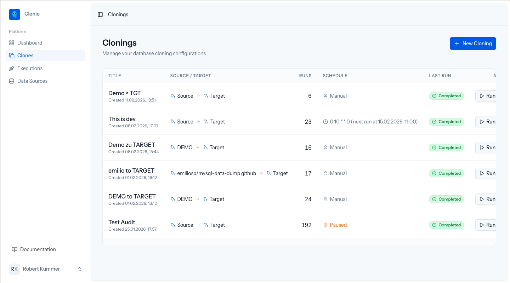

# Managing Clonings

The **Clones** page lists all cloning configurations with key information at a glance.

## Clonings List

The table displays:

| Column | Description |
|--------|-------------|
| **Title** | Cloning name and creation date |
| **Source / Target** | The source and target connection names |
| **Runs** | Total number of executions |
| **Schedule** | Manual, cron expression with next run time, or Paused |
| **Last Run** | Status of the most recent run (Completed, Failed) |
| **Actions** | Run button to trigger immediate execution |

Click on any row to open the cloning detail page.

## Cloning Detail Page

The detail page provides a full overview of a cloning configuration and its recent history.

### Header Actions

- **Run Now** -- Trigger an immediate execution
- **Edit** -- Open the cloning wizard to modify the configuration
- **Delete** -- Remove the cloning and all its run history

### Information Cards

- **Connections** -- Shows the source and target database connections
- **Schedule** -- Displays the execution schedule (manual, cron, or paused)
- **Estimated Duration** -- Based on recent run history, shows the expected execution time

### Recent Runs

The right side of the detail page shows recent cloning runs with their status, date, and duration. Click **View All** to navigate to the full execution history.

### PII / GDPR Compliance

At the bottom of the detail page, a compliance summary shows:

- The number of columns and tables with transformations applied
- The anonymization methods in use (Fake, Hash, Mask, Null)
- A confirmation that personally identifiable information is anonymized according to the configured rules

## Editing a Cloning

Click **Edit** on the detail page to open the same four-step wizard used during creation. All existing settings are pre-populated. Changes take effect on the next run.

Editing does not affect runs that are currently in progress.

## Deleting a Cloning

Click **Delete** on the detail page to permanently remove a cloning configuration. This also removes all associated run history and logs. This action cannot be undone.

## Next Steps

Learn about [Cloning Run Execution](/docs/3-cloning-runs/01-execution) to understand what happens during a run.
