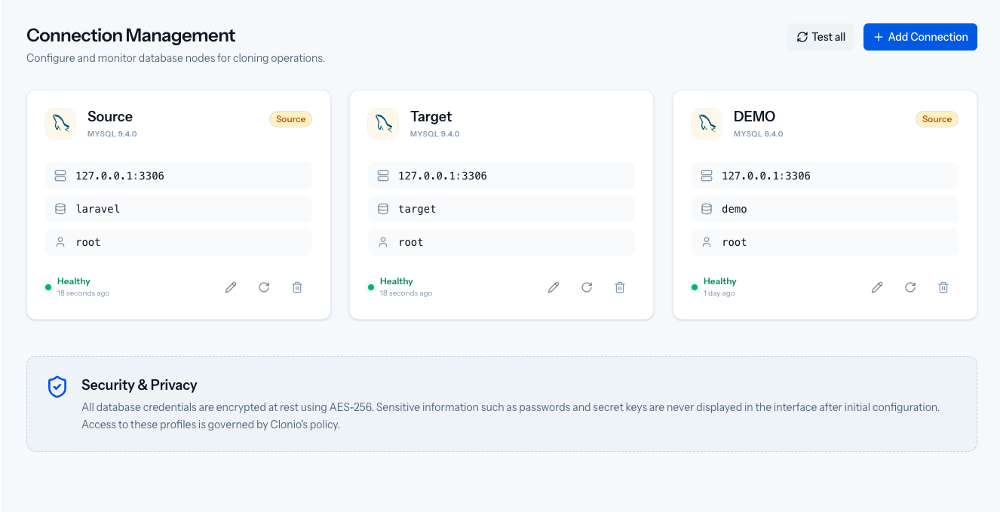
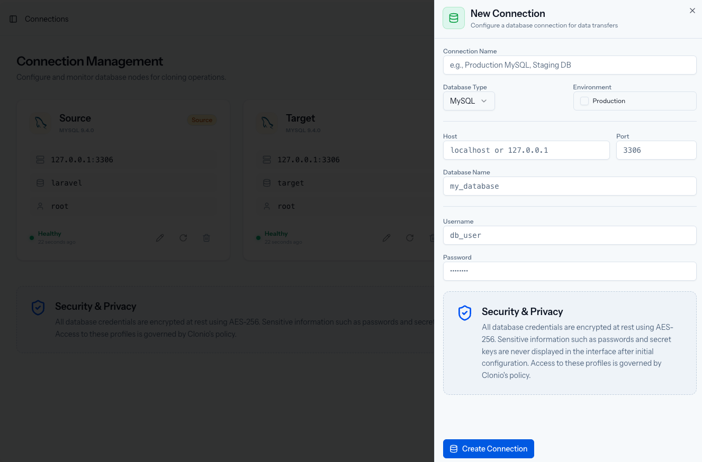

# Managing Connections

Before you can create a cloning, you need at least two database connections: a **source** (where data comes from, typically production) and a **target** (where anonymized data goes, typically test or staging).

## Connection Overview

Navigate to **Data Sources** in the sidebar to see all configured connections. Each connection card displays:

- Connection name and database type (MySQL, PostgreSQL, etc.)
- Host and port
- Database name
- Username
- Health status with last check timestamp
- Source/Target badge (if tagged)

From this page you can:

- **Test all** connections at once using the "Test all" button
- **Add Connection** to create a new connection
- **Refresh** individual connections using the refresh icon
- **Delete** connections using the trash icon

## Adding a Connection

Click **+ Add Connection** to open the connection form.

Fill in the following fields:

| Field | Description |
|-------|-------------|
| **Connection Name** | A descriptive label (e.g., "Production MySQL", "Staging DB") |
| **Database Type** | MySQL, MariaDB, PostgreSQL, or SQL Server |
| **Environment** | Optional flag to mark the connection as Production |
| **Host** | The database server hostname or IP address |
| **Port** | The database server port (default varies by type) |
| **Database Name** | The name of the database to connect to |
| **Username** | Database user with read access (source) or read/write access (target) |
| **Password** | Database user password |

### Security

All database credentials are encrypted at rest using AES-256. Passwords and secret keys are never displayed in the interface after initial configuration.

## Testing Connections

After creating a connection, Clonio automatically tests connectivity and displays the health status:

- **Healthy** (green) -- Connection successful, database is reachable
- **Unhealthy** (red) -- Connection failed, check credentials or network

You can re-test a single connection by clicking the refresh icon on its card, or test all connections at once with the "Test all" button.

## Required Permissions

### Source Connection (Read)

The source database user needs:

- `SELECT` on all tables to be cloned
- `SHOW DATABASES` / access to information schema for schema inspection

### Target Connection (Read/Write)

The target database user needs:

- `SELECT`, `INSERT`, `UPDATE`, `DELETE` on all tables
- `CREATE`, `ALTER`, `DROP` for schema replication
- `REFERENCES` for foreign key management

## Editing and Deleting

Click on a connection card to edit its details. To delete a connection, click the trash icon. A connection cannot be deleted if it is actively used in a cloning configuration.

## Next Steps

With connections configured, learn about the [Supported Databases](02-supported-databases) or jump ahead to [Creating a Cloning](/docs/2-clonings/01-creating-a-cloning).
