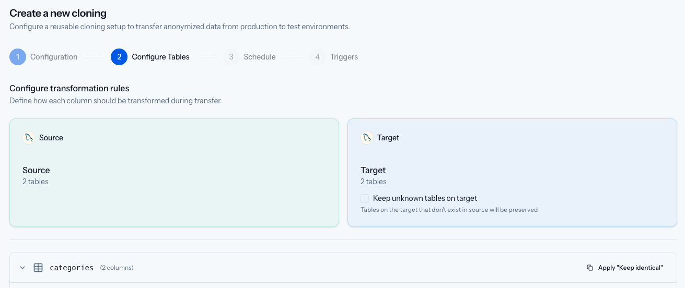
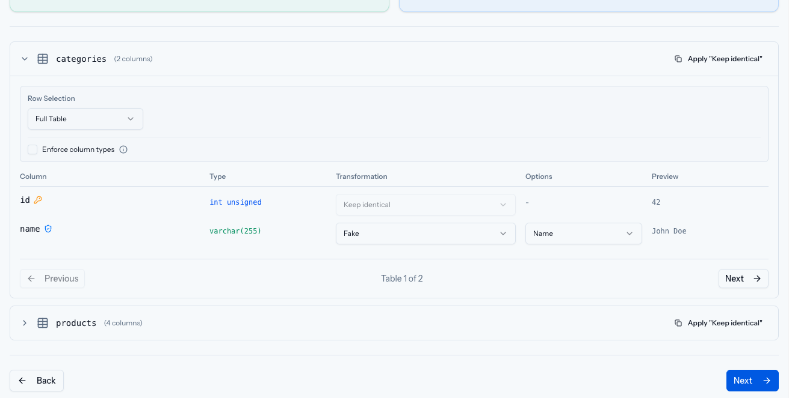
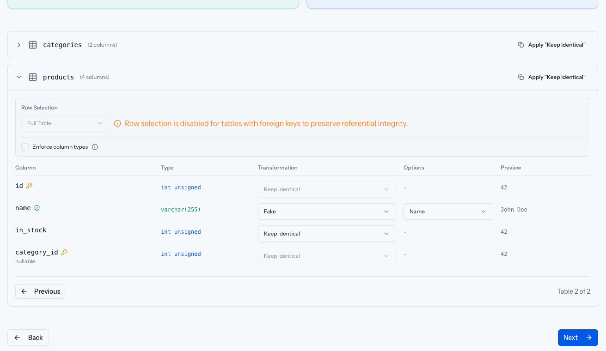
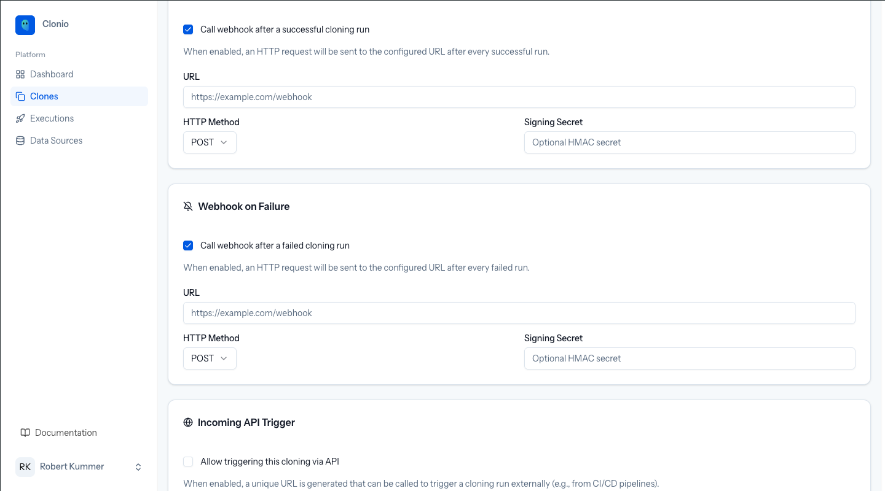
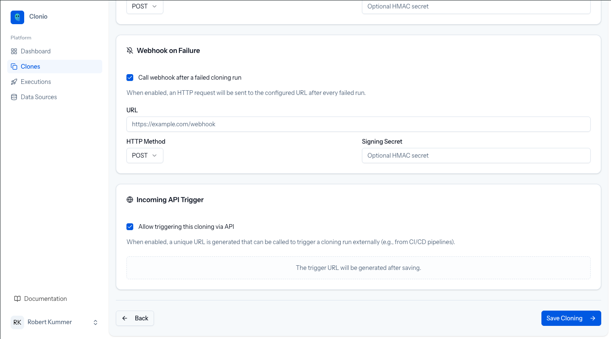

# Creating a Cloning

A cloning is a reusable configuration that defines how data is transferred from a source database to a target database. Creating one is done through a four-step wizard accessible from the **Clones** page.

Click **+ New Cloning** to start.

## Step 1: Configuration

The first step sets the cloning's identity and connections.


### Title

Give your cloning a descriptive name that identifies the purpose, such as "Production to Staging Sync" or "Nightly Dev Refresh". This name appears in the clonings list and in run logs.

### Source and Target Connections

Select the source (production) and target (test) database connections from the dropdowns. These must be configured beforehand in **Data Sources**.

- **Source Connection** — The database data is read from. Clonio only performs `SELECT` queries on the source.
- **Target Connection** — The database data is written to. Existing data on the target is replaced.

Click **Next** to proceed.

## Step 2: Configure Tables

This step lets you configure transformation rules for each table in the source database.



### Schema Summary

At the top you see the source and target database names with their table counts. The **"Keep unknown tables on target"** checkbox controls what happens to tables that exist on the target but not on the source:

- **Checked** — Extra tables on the target are preserved (not dropped)
- **Unchecked** — Extra tables on the target are removed during cloning

### Table List

Each table from the source is listed with its column count. Expand a table to configure it.



For each table you can configure:

#### Row Selection

Choose how many rows to copy:

- **Full Table** — Copy all rows (default)
- **First X** — Copy only the first X rows ordered by primary key
- **Last X** — Copy only the last X rows ordered by primary key descending

Row selection is automatically disabled for tables that have foreign key dependencies on other tables, to preserve referential integrity.



#### Column Transformations

Each column is listed with its name, data type, and a **Transformation** dropdown. Options include:

| Transformation | Description |
|---------------|-------------|
| **Keep identical** | Copy the value as-is from the source (default) |
| **Fake** | Generate a realistic but fake value using FakerPHP |
| **Hash** | Replace the value with a hashed version |
| **Mask** | Partially mask the value (e.g., `j***@example.com`) |
| **Null** | Set the column to `NULL` |

When **Fake** is selected, an additional **Options** dropdown appears where you choose the faker method (Name, Email, Phone, Address, etc.). The **Preview** column shows a sample of what the transformed value looks like.

#### Apply "Keep identical"

Click the **Apply "Keep identical"** button on a table header to reset all columns in that table to keep their original values.

#### Enforce Column Types

The **Enforce column types** checkbox enables strict type validation during transfer, ensuring that generated fake values match the column's data type constraints.

### Navigating Tables

Use the **Previous** and **Next** buttons at the bottom of each table's configuration, or click on a collapsed table header to expand it.

Click **Next** to proceed to scheduling.

## Step 3: Schedule

Configure when the cloning should execute.


### Immediate Execution

Check **"Execute cloning immediately after saving"** to trigger a run as soon as the cloning is created.

### Scheduled Execution

Check **"Enable scheduled execution"** to set up automated runs.


Two scheduling modes are available:

**Simple mode** provides quick presets and dropdowns:

- Quick presets: Every hour, Daily at midnight, Daily at 2 AM, Daily at 6 AM, Weekly on Sunday, Weekly on Monday, Monthly on 1st, Weekdays at 3 AM
- Custom frequency selection with hour and minute pickers
- A preview shows the resulting schedule in human-readable format along with the cron expression

**Advanced mode** lets you enter a raw cron expression directly (e.g., `0 10 * * 0`).

Click **Next** to proceed to triggers.

## Step 4: Triggers

Configure webhooks and API triggers for integration with external systems.


### Webhook on Success

When enabled, Clonio sends an HTTP request to the configured URL after every successful cloning run. Configure:

- **URL** — The endpoint to call (e.g., `https://example.com/webhook`)
- **HTTP Method** — POST (default) or other methods
- **Signing Secret** — An optional HMAC secret for verifying webhook authenticity



### Webhook on Failure

Same configuration as the success webhook, but triggered after a failed cloning run. Useful for alerting systems like PagerDuty or Slack.

### Incoming API Trigger

When enabled, Clonio generates a unique URL that can be called externally to trigger a cloning run. This is ideal for CI/CD integration.



The trigger URL is displayed after saving, along with ready-to-use `curl` and `wget` commands:

```bash
curl -X POST http://your-clonio-instance/api/trigger/<token>
```

Keep this URL secret — anyone with the URL can trigger a cloning run.


### Saving

Click **Save Cloning** to create the cloning configuration. If "Execute immediately" was checked in Step 3, the first run will start right away.

## Next Steps

Learn more about [Anonymization](02-anonymization) strategies, or see how to [manage existing clonings](04-managing-clonings).
